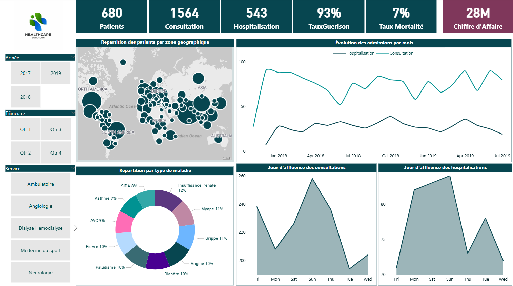
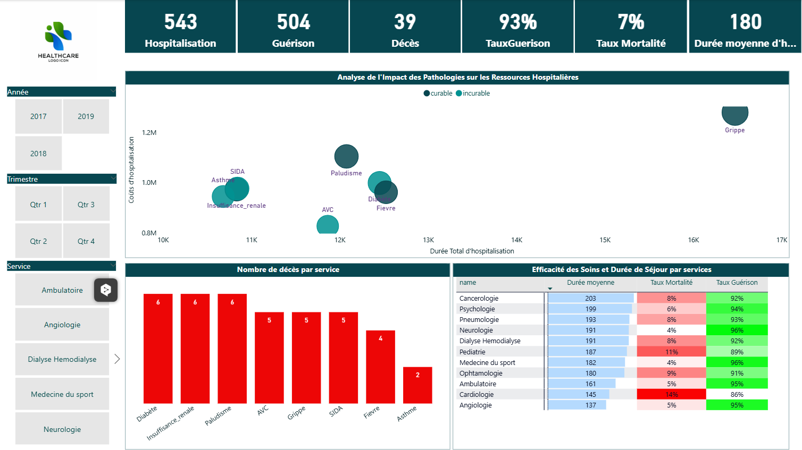
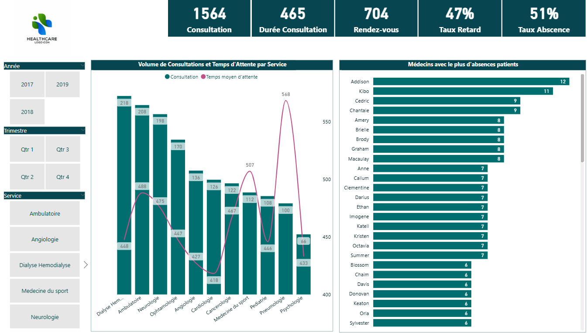
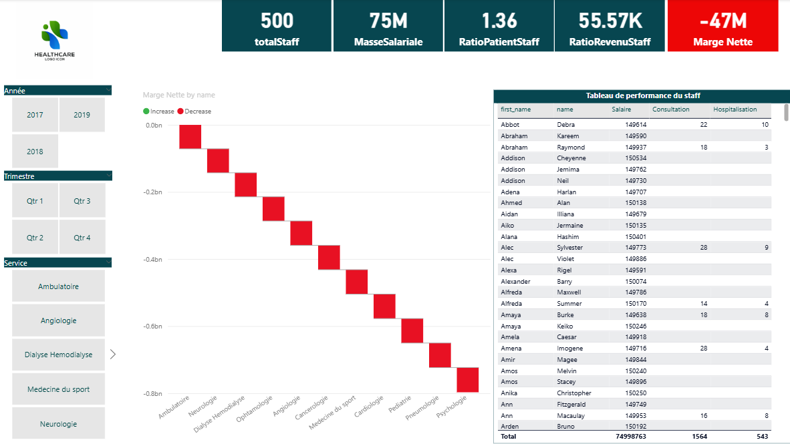

#  Healthcare Performance Dashboard

## Aperçu du Projet
Ce projet consiste en la conception et le développement d'un tableau de bord décisionnel (Business Intelligence) pour un établissement de santé. L'objectif est d'analyser la performance hospitalière sous quatre angles : l'activité globale, la qualité clinique, l'efficacité opérationnelle et la rentabilité financière.

**Lien interactif (optionnel) :** [Insérer lien web si publié]

## Outils & Technologies
*   **Microsoft Power BI :** Visualisation des données et DAX.
*   **Power Query (M) :** ETL, Nettoyage et transformation des données.
*   **Excel :** Source de données.
*   **Modélisation en étoile :** Structure Fact/Dimension.

## Processus ETL & Qualité des Données
Un travail approfondi de nettoyage a été réalisé pour fiabiliser les données brutes :
*   **Optimisation de la mémoire :** Utilisation de `List.Buffer` dans Power Query pour attribuer aléatoirement des villes à 10 000+ patients sans saturer la RAM (éviter le produit cartésien).
*   **Cohérence Clinique :** Correction des incohérences logiques (patients marqués simultanément comme "Guéris" et "Décédés") via des colonnes conditionnelles.
*   **Correction Structurelle :** Génération de données temporelles aléatoires pour corriger une table de faits ne contenant qu'une seule date d'enregistrement.
*   **Intégrité référentielle :** Nettoyage des IDs de maladies dans la table des Rendez-vous pour correspondre à la table de dimension.

## Structure du Tableau de Bord

### 1. Vue d'ensemble (Overview)
Analyse macroscopique de l'activité (1564 consultations, 543 hospitalisations) et de la répartition géographique des patients.

### 2. Analyse Clinique (Hospitalisation)
Focus sur la qualité des soins.
*   **Taux de guérison :** 93%
*   **Taux de mortalité :** 7%
*   Identification des pathologies les plus mortelles et les plus coûteuses (ex: Grippe, Insuffisance rénale).

### 3. Performance Opérationnelle
Analyse des flux et des goulots d'étranglement.
*   Mise en évidence d'un **taux d'absentéisme critique (51%)** aux rendez-vous.
*   Analyse des temps d'attente par service.

### 4. Ressources Humaines & Finances
Analyse de la rentabilité.
*   Mise en lumière d'un **déficit structurel** (-47M).
*   Identification d'un sur-effectif important (Ratio Staff/Patient de 1.36) et d'une productivité inégale selon les employés.

## Conclusions & Recommandations
L'analyse des données a permis de dégager des recommandations stratégiques :
1.  **Restructuration RH :** Audit nécessaire du personnel, car la masse salariale (75M) n'est pas couverte par les revenus (28M).
2.  **Optimisation des RDV :** Mise en place urgente de rappels automatiques pour réduire les 51% d'absences.
3.  **Audit Médical :** Investigation requise sur les services de Cardiologie et Pédiatrie qui présentent des taux de mortalité supérieurs à la moyenne.

---
*Contact : www.linkedin.com/in/germainananou
